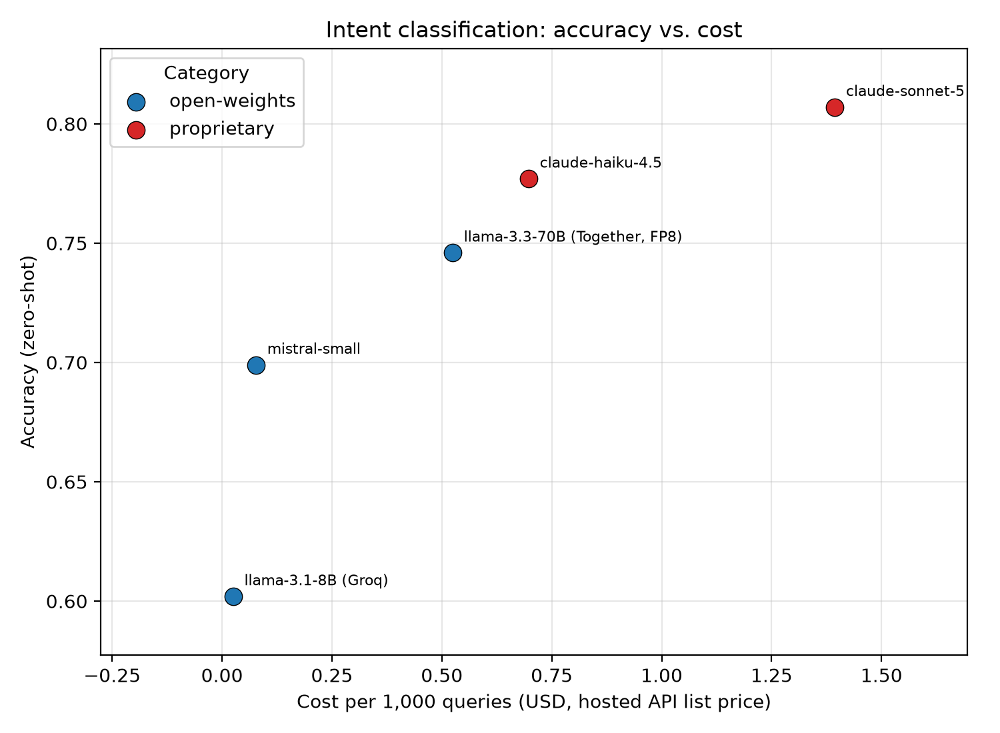

# CX-LLM-Bench

Benchmark code and results for the paper "Closing the Compliance Gap: Benchmarking Open-Weights and Proprietary Large Language Models for Privacy-Constrained Contact Center Automation". First author; under review at the NeurIPS 2026 Workshop on AI Privacy (InfPriv).

## What it is

Healthcare and other privacy-constrained enterprises often cannot send customer conversations to a proprietary API, which restricts them to self-hostable open-weights models. This benchmark measures what that restriction costs in task performance. Six models (two proprietary, three open-weights, plus a capped Gemini subsample) were evaluated on intent classification (Banking77, zero-shot and few-shot with k=5) and conversation summarization (TweetSumm as the primary corpus of real customer-support dialogue, DialogSum as an out-of-domain check). Every call is cached on (model, prompt, max_tokens), so reruns are free and interrupted runs resume where they stopped.

## What I built

The whole pipeline in `src/`: the runners for both tasks, the TweetSumm reconstruction loader, multi-reference ROUGE scoring, paired bootstrap confidence intervals, list-price cost accounting with sourced prices, a consistency check that serves the same open-weights model from two providers, the report generator, and the blinded expert rating sheet. `results/` holds the aggregate tables, charts, run report, methods notes, and the full 4,000-call intent record.

## How it was built and verified

Built by orchestrating coding agents: `CLAUDE.md` is the brief the agent worked from, phased so that a smoke test and a cost estimate came back for approval before any full run. Verified by smoke tests with `--limit` before every full run; paired bootstrap confidence intervals (10,000 resamples) on every headline comparison, reported in `results/NOTES.md`; the cross-provider consistency check; and a blinded human expert rating of 40 TweetSumm summaries, whose sheet and key are held back until the anonymized results are released.

## Headline results

On intent classification the best open-weights model trails the best proprietary model by 7.56% relative accuracy zero-shot and 6.66% few-shot, at roughly 2.7x lower list price per thousand queries. On TweetSumm summarization the ordering inverts: Llama-3.3-70B beats the best proprietary model by 8.26% relative ROUGE-L, and the paired bootstrap interval excludes zero. The same comparison on DialogSum is within noise, so summarization rankings are corpus-specific. The whole benchmark took 10,656 API calls and $7.62 at measured billing. Because the 70B model was served FP8-quantized, the reported gaps are upper bounds.

Full results: [`results/tables.md`](results/tables.md). Methods detail: [`results/NOTES.md`](results/NOTES.md). Provenance and cost: [`results/RUN_REPORT.md`](results/RUN_REPORT.md).



## Quickstart

```bash
python3 -m venv venv && source venv/bin/activate
pip install -r requirements.txt

cp .env.example .env      # then fill in your API keys
```

### Getting the summarization data (required for the primary result)

The primary summarization corpus is **TweetSumm**, which distributes only tweet
**IDs**: the tweet **text** must come from Kaggle. That is a licensing
requirement (CDLA-Sharing-1.0), so this repository ships the loader and nothing
else; no dialogue text is redistributed here.

```bash
git clone https://github.com/guyfe/Tweetsumm.git vendor/tweetsumm

# Download "Customer Support on Twitter" from Kaggle, then:
#   https://www.kaggle.com/datasets/thoughtvector/customer-support-on-twitter
mkdir -p data && mv /path/to/twcs.csv data/twcs.csv

python src/tweetsumm_loader.py    # verify reconstruction
```

That check should report `tweet_ids_found_in_twcs` equal to
`tweet_ids_referenced` and `dialogues_skipped_missing_tweets: 0`. Both `data/`
and `vendor/` are gitignored. The secondary DialogSum corpus downloads
automatically from the Hub and needs no setup.

Keys are read from `.env` by `src/common.py`. **A key exported in your
interactive shell will not reach a spawned run**: put it in `.env`.

Run in this order:

```bash
python src/run_intent.py                       # Banking77: zero-shot + few-shot
python src/run_summ.py --dataset tweetsumm     # PRIMARY summarization
python src/run_summ.py --dataset dialogsum     # secondary robustness check
python src/rebuild_summaries.py                # rebuild summaries from raw logs
python src/report.py                           # -> results/tables.md + charts
python src/make_rating_sheet.py                # blinded expert rating sheet
```

Useful flags:

- `--limit N`: smoke-test with a small sample
- `--models a,b`: run a subset; **each model should run in its own process**,
  because rate limiting is per-model *within* a process (see below)
- `--conditions zero_shot` (intent only): run one condition when the budget
  cannot cover both

Every call is cached in `cache/` keyed on `(model, prompt, max_tokens)`, so
reruns are free and interrupted runs resume exactly where they stopped. Failed
calls are never cached, so a rerun retries them.

Optional: `src/consistency_check.py` compares the same open-weights model served
by two different providers.

---

## The rate-limit lesson: budget the whole workload against the *daily* cap

The single most costly mistake in this project, and it is not the one it first
appeared to be.

`llama-3.1-8b-instant` completed its 1,000 zero-shot calls and then crawled at
~120 s/call on few-shot, eventually being abandoned at ~32 h projected. This was
initially diagnosed as a tokens-per-*minute* problem and "fixed" by increasing
the per-request delay. The provider's own error message says otherwise:

```
Rate limit reached ... on tokens per day (TPD):
Limit 500000, Used 499554, Requested 684.
```

Groq's free tier meters that model at **500,000 tokens per day**. The zero-shot
arm (1,000 calls at ~500 prompt tokens) had spent essentially the entire daily
budget. The slow crawl afterwards was the bucket *refilling* at ~5.8 tokens/sec,
not backoff thrash. **No per-request delay recovers a budget that is already
spent.**

What to actually do:

1. **Compute `n_calls x prompt_tokens` against the daily token cap before you
   start.** Here that was 2,100 x ~570 ≈ 1.2M tokens against 500k/day: the
   workload never fit in one day, and no pacing could have changed that.
2. **Order conditions by cost when they share a budget.** Running the cheap arm
   first consumed the whole day.
3. **Per-minute pacing is a separate constraint.** Both matter; don't conflate
   them. Read the `x-ratelimit-*` response headers rather than trusting the
   client library: daily caps in particular are often absent from it.

Two related traps documented in `results/NOTES.md`:

- **Request-per-day caps bite too.** Groq allows 1,000 requests/day for
  `llama-3.3-70b-versatile` (~52 h for this workload, which forced a move to a
  paid host); Gemini's free tier caps `gemini-3.5-flash-lite` at 500/day.
- **Thinking models cannot answer under a small `max_tokens`.** Several
  otherwise-capable models spend the entire completion budget reasoning and
  return a truncated fragment, which scores as ~0 accuracy and looks like a
  parsing bug. They were excluded rather than reported as broken scores.

---

## Cost figures are list price, not what we paid

Four of the six models ran on **free promotional tiers**, so billed cost is ~$0
for them. Plotting that would make the cost axis an artifact of promotions, so
`report.py` prices every call at its provider's **published list price**
(`src/list_price.py`, with sources and retrieval dates).

Two caveats worth repeating:

- This is **hosted API list price**, *not* self-hosting TCO. GPU capital or
  rental, engineering time, and idle capacity are the real costs a
  privacy-constrained enterprise trades against, and none are on this axis.
- Client-library price tables can be stale. Three of six models were mispriced
  in the bundled table of the version used (one by 3x/6.25x); all prices here
  were verified against vendor pages. **Re-derive before reusing**: one model's
  rate was introductory pricing with a known expiry.

---

## Repository layout

```
src/                     benchmark, reporting and analysis code
config.yaml              model lineup, rate limits, sample sizes
results/tables.md        per-model metrics + the compliance-gap table
results/NOTES.md         Methods-level detail: datasets, model IDs, rate
                         limits, pricing provenance, threats to validity
results/RUN_REPORT.md    cost, call counts, every substitution and failure
results/charts/          accuracy-vs-cost, ROUGE-L-vs-cost, zero vs few-shot
results/raw/             call-level record (10,656 calls): the data artifact
CLAUDE.md                original project brief
```

**Not in this repository:**

- `cache/`: ~10k cached API responses, too heavy to commit and fully
  reproducible from the code. **Available on request.**
- `results/expert_rating_sheet.csv` and its blinding key: the blinded human
  expert evaluation is **complete**: a domain expert rated 40 TweetSumm
  summaries (5 models x 8, usefulness 1-5 plus missing-critical-info and
  would-trust-at-handoff judgements) without access to model identities.
  **Anonymized per-model rating results will be added in a post-review commit.**
  The sheet and its key stay held back so the raw per-sample judgements and the
  code→model mapping are not published ahead of that write-up, and the sheet
  additionally contains reconstructed dialogue text, which is license-restricted
  regardless (see below).
- `results/summ_outputs.json` and `results/raw/summ.jsonl`: **held back for the
  same reason**: both map each generated summary to the model that produced it,
  which would de-blind the expert evaluation. Aggregate
  summarization metrics are public in `results/tables.md`; the per-call records
  are **available on request** and will be released with the rating results.
  `results/raw/intent.jsonl` (the 4,000-call intent record) is published in
  full, since it carries no blinding concern.
- `results/run_logs/`: raw provider stdout, build noise rather than results.
- `paper/`: manuscript draft, held back until authorship is finalized.

---

## Reproducibility notes

- `temperature=0` and `seed=42` throughout (with `drop_params` for providers
  that reject `seed`). Determinism is *not* guaranteed across providers: the
  same open-weights model served by two hosts produced summaries with a
  cross-provider ROUGE-L of 0.639 (substantially different wording) while
  scoring within 0.002 of each other against the reference.
- Datasets: Banking77 via `legacy-datasets/banking77` (test split, seed-42
  shuffle, first 1,000). Summarization primary: **TweetSumm** test split
  (110 dialogues, all 1,152 referenced tweet IDs resolved, seed-42 shuffle,
  first 100), reconstructed locally from tweet IDs + Kaggle `twcs.csv` using the
  upstream `TweetSumProcessor`; the **first** of each dialogue's three human
  abstractive annotations is the reference. Summarization secondary:
  `knkarthick/dialogsum` (test split, seed-42 shuffle, first 100), retained as a
  cross-domain robustness check: it is general-domain daily conversation, not
  customer support.
- **Licensing:** TweetSumm's dataset is CDLA-Sharing-1.0 and its tweet text
  comes from Kaggle. This repository therefore contains **no** dialogue text,
  no `twcs.csv`, and no summarization records derived from it: only the loader
  and the IDs. Reproducers fetch the text from Kaggle themselves.
- Moving aliases (`mistral-small-latest`, `gemini-flash-lite-latest`) may
  hot-swap. Concrete snapshots served during this run are recorded in
  `results/NOTES.md` §10: cite those, not the aliases.
- Sample sizes were reduced from 1,500/120 to 1,000/100 to fit free-tier daily
  request caps. The reduction is cache-safe: the test split is shuffled *before*
  slicing, so the smaller set is a valid random subsample.

---

## Citation

```bibtex
@misc{nagaraju2026compliancegap,
  title   = {Closing the Compliance Gap: Benchmarking Open-Weights and Proprietary
             Large Language Models for Privacy-Constrained Contact Center Automation},
  author  = {Nagaraju, Tarun and others},
  year    = {2026},
  note    = {Under review at the NeurIPS 2026 Workshop on AI Privacy (InfPriv).
             Artifact: https://github.com/riptide-06/cx-llm-bench}
}
```

## License

MIT. See [LICENSE](LICENSE).
